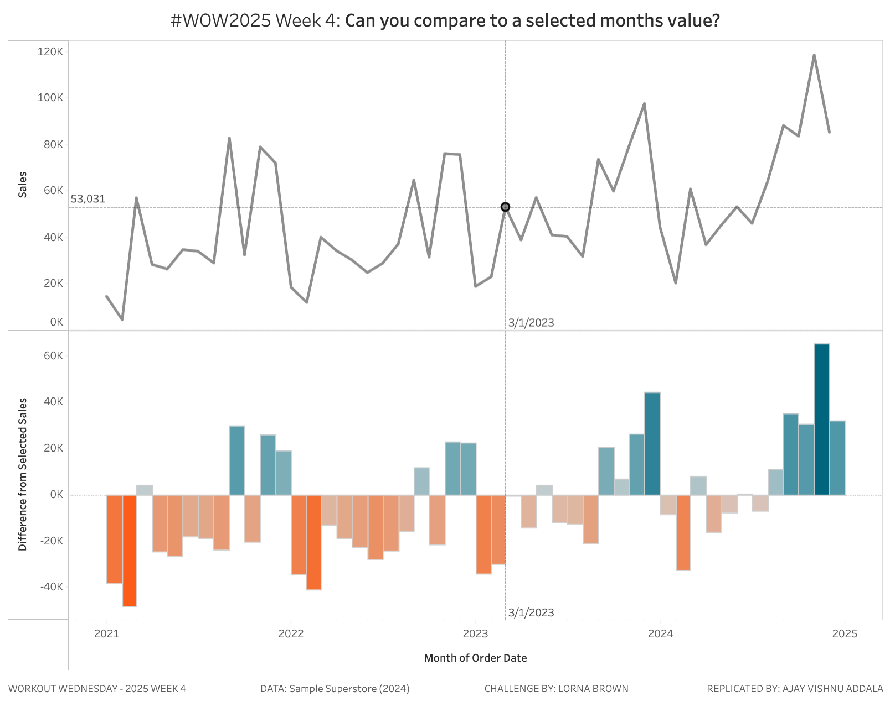

# WOW2025 Week 4: Compare to a Selected Month's Value

## Overview

This Tableau dashboard was created as part of **Workout Wednesday 2025 Week 4**. The challenge compares each month's sales value to a selected month's sales value without using Level of Detail (LOD) calculations or Table Calculations. This is achieved using **Parameters** and **Parameter Actions**.

### Challenge Requirements:
- **Dashboard size:** 1000×800  
- **Sheets:** 1  
- **Restrictions:** No LODs or Table Calcs allowed.  
- **Functionality:** Users can select a month by clicking on the sales line chart, and all other months' values will compare to the selected month's value.  

**Dataset:** Sample Superstore Data (2024 version), sourced from [Data.World](https://data.world).

---

## Dashboard Features

1. **Interactive Line Chart**  
   - Users can click on any month's data point to set it as the "Selected Month."
   - All other months' values are compared to this selected month.

2. **Dynamic Comparisons**  
   - Sales for all months are displayed relative to the selected month's value.  
   - Positive or negative differences are visually distinguished.

3. **No LODs or Table Calculations**  
   - The challenge constraints were followed by leveraging Parameters and Parameter Actions exclusively.

---

## Snapshot

  
*Snapshot of the Tableau dashboard.*

---

## Tableau Public Link

You can explore the interactive dashboard on [Tableau Public](https://public.tableau.com/app/profile/ajay.vishnu.addala/viz/WOW2025W4_17376531568780/WOW2025-W4).

---
